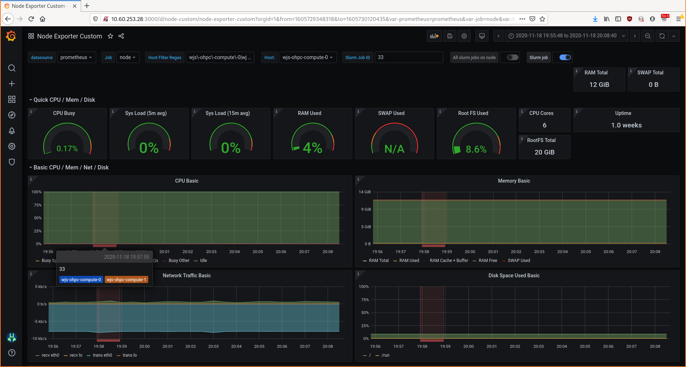
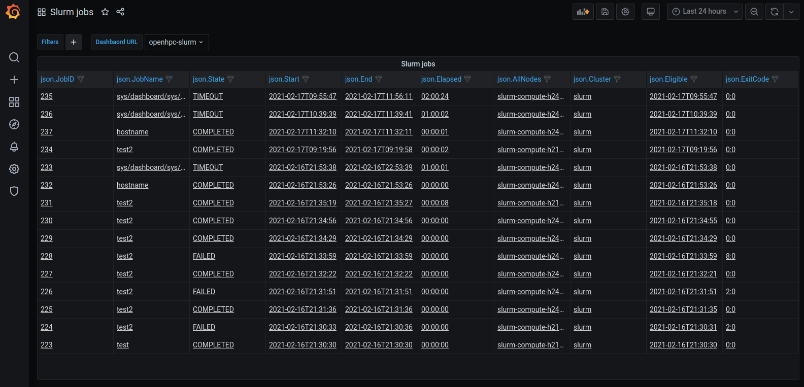
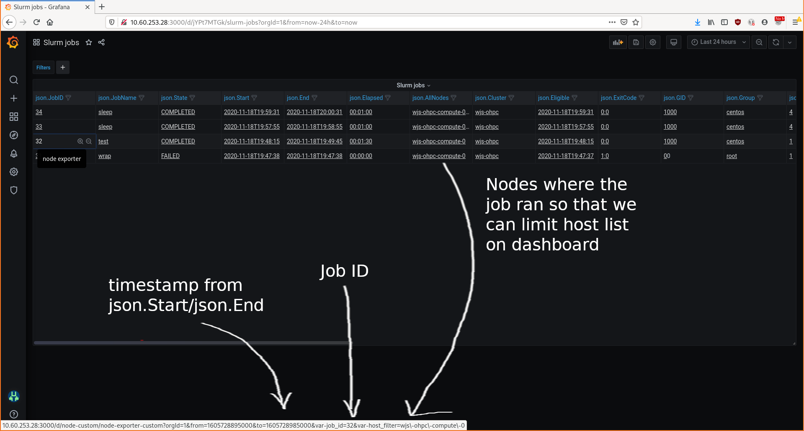
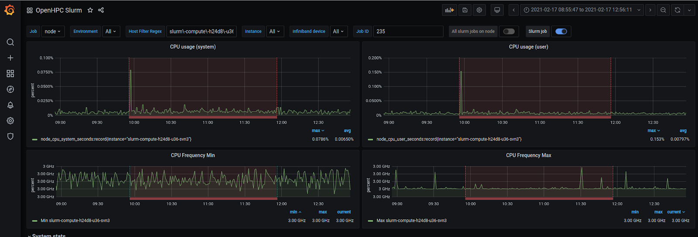

# Monitoring and logging configuration

## Components overview

### [filebeat](https://www.elastic.co/beats/filebeat)

Parses log files and ships them to elasticsearch. Note we use the version shipped by Open Distro.

### [grafana](https://grafana.com/)

Visualisation tool that supports multiple different datasources. In our stack,
we use it to visualise prometheus and elasticsearch data.

### [opensearch](https://https://opensearch.org/)

A search engine that provides full text search over a collection of JSON documents. In this project,
the main use is for the archiving and retrieval of log files.

### [prometheus](https://prometheus.io/)

Stores metrics in a time series database and makes them available via the Prometheus Query Language (PromQL).
Metrics are scraped from exporters. Exporters are services which expose HTTP endpoints that prometheus will periodically scrape to harvest new metrics.

### [slurm-stats](https://github.com/stackhpc/slurm-openstack-tools)

Tool which parses slurm accounting data and produces a log file that is suitable for ingest by filebeat.

## Definition of terms

In this section we define any terms that may not be widely understood.

### Internal roles

When referring to an "internal" role, we are referring to a role that is checked in to the appliance repository. These can be found in the following directory:

> ansible/roles/<role_name>

Where `role_name` is the name of the internal role.

## Customising variables

You should only customise the variables in `environments/common` if you are working on a feature that you intend to contribute back. Instead you should override the variables in the environment relevant to your deployment. This is possible since inventories later in the inheritance chain have greater precedence. Please see [README.md](../README.md#environments) for a more detailed explanation. This notice exists to avoid the need to need to keep repeating this point in the following sections. Where it is noted that you should customise a variable, it is implied that this change should be made to your own environment e.g `environments/production` in preference to `environments/common`, even when
this is not explicitly stated.

## filebeat

This section details the configuration of filebeat.

### Defaults

Filebeat is configured by the internal `filebeat` role which can be found here:

> [ansible/roles/filebeat](../ansible/roles/filebeat)

The appliance defaults for the `filebeat` role can be found at the following location:

> [environments/common/inventory/group_vars/all/filebeat.yml](../environments/common/inventory/group_vars/all/filebeat.yml)

### Overview

Filebeat is configured to scrape the output of slurm stats. Slurm stats produces a json log file in the following location on the host:

> /var/log/slurm-stats/finished_jobs.json

This is exposed to the `filebeat` container through a volume which mounts `/var/log` on the host to `/logs` in the container, where `/logs` is used to differentiate the host logs from the container logs.

Filebeat is configured to read this log file and post the data to elasticsearch via:

> [environments/common/files/filebeat/filebeat.yml](../environments/common/files/filebeat/filebeat.yml)

This file is configurable by the `filebeat_config_path` variable.

It is not currently possible to partially override `filebeat.yml`. You will have to configure `filebeat_config_path` to refer to another file, copying
the parts of the default configuration you want to keep. Pull requests are welcomed to add the functionality needed to allow for partial overrides.

### Placement

The `filebeat` group controls the placement of the `filebeat` service. The default configuration scrapes the `slurm_stats` service output. This requires a `filebeat` instance to be co-located with the `slurm_stats` service.

In the simplest configuration, a single host should be assigned to the `filebeat` and `slurm_stats` group. The host assigned to the `slurm_stats` group should the same host as assigned to the `filebeat` group. More advanced configurations are possible, but require overriding `filebeat_config_path` using `group` or `host` variables.

## grafana

This section details the configuration of grafana.

### Defaults

Internally, we use the [cloudalchemy.grafana](https://github.com/cloudalchemy/ansible-grafana) role. You can customise any of the variables that the role supports. For a full list, please see the
[upstream documentation](https://github.com/cloudalchemy/ansible-grafana). The appliance defaults can be found here:

> [environments/common/inventory/group_vars/all/grafana.yml](../environments/common/inventory/group_vars/all/grafana.yml)

### Placement

The `grafana` group controls the placement of the grafana service. Load balancing is currently unsupported so it is important that you only assign one host to this group.

### Access

If Open Ondemand is enabled then by default this is used to proxy Grafana, otherwise Grafana is accessed through the first . See `grafana_url` in [environments/common/inventory/group_vars/all/grafana.yml](../environments/common/inventory/group_vars/all/grafana.yml). The port used (variable `grafana_port`) defaults to `3000`.

The default credentials for the admin user are:

    username: grafana
    password: <vault_grafana_admin_password>

Where `vault_grafana_admin_password` is a variable containing the actual password. This is generated by the `generate-passwords.yml` adhoc playbook (see [README.md](../README.md#creating-a-slurm-appliance)).

### grafana dashboards

The appliance ships with a default set of dashboards. The set of dashboards can be configured via the `grafana_dashboards` variable. The dashboards are either internal to the [grafana-dashboards role](../ansible/roles/grafana-dashboards/files/) or downloaded from grafana.com.

#### node exporter

This shows detailed metrics about an individual host. The metric source is `node exporter` (See [prometheus section](#prometheus-1) for more details). A slurm job annotation can optionally be enabled which will highlight the period of time where a given slurm job was running. The slurm job that is highlighted is controlled by the `Slurm Job ID` variable. An example is shown below:

#### slurm jobs

This dashboard shows all of the slurm jobs that have run in a given time window. An example screenshot is show below:

Clicking on a row will link you to either the "openhpc" dashboard, or the "node exporter" dashboard. The "target dashboard" is controlled by the `Dashboard URL` drop-down menu. By navigating to these dashboards in this manner, slurm job annotations will be enabled. This will:

1. Highlight the slurm job, corresponding to the one you clicked, on the target dashboard.

2. It will also pass a regular expression matching nodes where the job was active. This causes the `Instance` drop down to only show those hosts.

3. Narrow the time window so that the dashboard will only show the period of time where the job was active.

This is show below:

#### openhpc

This dashboard is used visualise metrics from a group of hosts. The grouping is configured via the `env` label on the prometheus metrics (See [prometheus section](#prometheus-1) for more details). Grafana annotations are used to display the start and stop times of slurm jobs. An example screenshot is shown below:

The region highlighted in red shows the start and stop times of an example slurm job.

### datasources

The default configuration configures the following datasources:

1. elasticsearch

   Connects to the `opendistro` service that is deployed by this appliance.

2. prometheus

   Connects to the `prometheus` service that is deployed by this appliance.

This can be customised with the `grafana_datasources` variable.

## opensearch

This section details the configuration of OpenSearch.

### Defaults

The internal `opensearch` role is used to configure the service. The list of variables that can be customised can found in:

> [ansible/roles/opensearch/defaults/main.yml](../ansible/roles/opensearch/defaults/main.yml)

The appliance defaults are in the following file:

> [environments/common/inventory/group_vars/all/opensearch.yml](../environments/common/inventory/group_vars/all/opensearch.yml)

### Placement

The `opensearch` group determines the placement of the OpenSearch service. Load balancing is currently unsupported so it is important that you only assign one host to this group.

### Access

By default, OpenSearch only listens on the loopback interface. It should therefore be placed on the same node as `filebeat` and `grafana` which need to access the OpenSearch API.

### Users

The default set of users is defined in:

> [environments/common/files/opensearch/internal_users.yml](../environments/common/files/opensearch/internal_users.yml)

This defines an the following accounts:

| username      |  password                                       | purpose                                   |
| ------------- | ------------------------------------------------|-------------------------------------------|
| admin         | <vault_elasticsearch_admin_password>  | User of highest privilege                 |

Where the password field refers to a variable containing the actual password. These are generated by the
`generate-passwords.yml` adhoc playbook (see [README.md](../README.md#creating-a-slurm-appliance)).

The admin account can be used to add additional users. As the account has full admin privileges
the credentials should be treated with extreme care.

To override the default set of users, you can customize the variable:

> [environments/common/files/opensearch/internal_users.yml](../environments/common/files/opensearch/internal_users.yml)

You can change this file by modifying the variable, `opensearch_internal_users_path`, where the default can be
found in:

> [environments/common/inventory/group_vars/all/opensearch.yml](../environments/common/inventory/group_vars/all/opensearch.yml)

## Prometheus

This section details the configuration of prometheus.

### Defaults

Internally, we use the [cloudalchemy.prometheus](https://github.com/cloudalchemy/ansible-prometheus) role. You can customise any of the variables that the role supports. For a full list, please see the
[upstream documentation](https://github.com/cloudalchemy/ansible-prometheus). The appliance defaults can be found here:

> [environments/common/inventory/group_vars/all/prometheus.yml](../environments/common/inventory/group_vars/all/prometheus.yml)

### Placement

The `prometheus` group determines the placement of the prometheus service. Load balancing is currently unsupported so it is important that you only assign one host to this group.

### Access

Prometheus is exposed on port `9090` on all hosts in the prometheus group. Currently, the configuration assumes a single host. Following the reference layout in `environments/common/layouts/everything`, this will be set to the slurm `control` node, prometheus would then be accessible from:

 > http://<control_node_ip>:9090

The port can customised by overriding the `prometheus_web_external_url` variable.

Note that this service is not password protected, allowing anyone with access to the URL to make queries.

### Recording rules

The upstream documentation can be found [here](https://prometheus.io/docs/prometheus/latest/configuration/recording_rules/).

This appliance provides a default set of recording rules which can be found here:

> [environments/common/files/prometheus/rules/precompute.rules](../environments/common/files/prometheus/rules/precompute.rules)

The intended purpose is to pre-compute some expensive queries that are used
in the reference set of grafana dashboards.

To add new, or to remove rules you will be to adjust the `prometheus_alert_rules_files` variable. The default value can be found in:

> [environments/common/inventory/group_vars/all/prometheus.yml](../environments/common/inventory/group_vars/all/prometheus.yml)

You can extend this variable in your environment specific configuration to reference extra files or to remove the defaults. The reference set of dashboards expect these variables to be defined, so if you remove them, you
will also have to update your dashboards.

### node_exporter

The upstream documentation can be found [here](https://github.com/prometheus/node_exporter).

Collects OS level metrics such as CPU usage, Memory usage, and IO statistics. The metrics that
are collected can be controlled by enabling different sets of collectors. For a full list
of collectors that are available, see the upstream documentation.

This appliance customises the default set of collectors to a minimal set, these are:

- netdev
- cpu
- meminfo
- infiniband
- cpufreq

The list can be customised by overriding the `collect[]` parameter of the `node` job in the `prometheus_scrape_configs` dictionary. The defaults can be found in:

> [environments/common/inventory/group_vars/all/prometheus.yml](../environments/common/inventory/group_vars/all/prometheus.yml).

Variables in this file should *not* be customised directly, but should be overridden in your `environment`. See [README.md](../README.md#environments) which details the process of overriding default variables in more detail.

### custom ansible filters

#### prometheus_node_exporter_targets

Groups prometheus targets into per environment groups. The ansible variable, `env` is used to determine the grouping. The metrics for each target in the group are given the prometheus label, `env: $env`, where `$env` is the value of the `env` variable for that host.

## slurm-stats

Slurm stats periodically queries the slurm accounting database to gather information about slurm jobs. The information it collects is output to a log file on the host at the following path:

> /var/log/slurm-stats/finished_jobs.json

The polling of this data is controlled by a cron job. The default is to scrape the data every 5 minutes.

### Defaults

slurm-stats is configured `slurm-stats` role in the [slurm_openstack_tools collection](https://github.com/stackhpc/ansible_collection_slurm_openstack_tools). Currently there is no customisation of this role in the common environment i.e we are just using role defaults. It is possible to override these by setting the relevant variable in your environment config. See [here](https://github.com/stackhpc/ansible_collection_slurm_openstack_tools/tree/main/roles/slurm-stats) for a list of variables that can be set.

### Placement

The `slurm_stats` group controls the placement of the `slurm_stats` service.
This should be configured to be a group with a single host. That host must be co-located on the same host as the `filebeat` service that scrapes its output.

