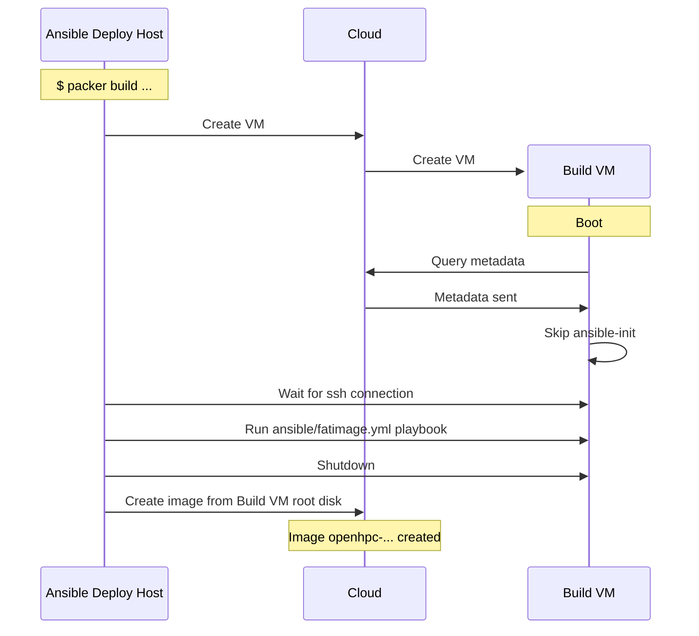

# Slurm Appliance Sequences


## Image build

This sequence applies to both "fatimage" builds (usually only done in StackHPC CI) and "extra" builds. The differences are:
- Which image the build VM uses, i.e. the starting image: A genericcloud image for fatimage builds or a fatimages build for an extra build.
- Which inventory groups the build VM is added to.

Note that ansible-init does not run during an image build. It is disabled via a metadata flag.



## Cluster Creation

```mermaid
sequenceDiagram
    participant ansible as Ansible Deploy Host
    participant cloud as Cloud
    note over ansible: $ ansible-playbook ansible/adhoc/generate-passwords.yml
    ansible->>ansible: Template secrets to inventory group_vars and tofu metadata
    note over ansible: $ tofu apply ....
    ansible->>cloud: Create infra
    create participant nodes as Cluster Instances
    cloud->>nodes: Create instances
    note over nodes: Boot
    rect rgb(204, 232, 252)
    note over nodes: ansible-init
    nodes->>cloud: Query metadata
    cloud->>nodes: Metadata sent
    nodes->>nodes: Start k3s and connect to its peers
    end
    note over ansible: $ ansible-playbook ansible/site.yml
    ansible->>nodes: Wait for ansible-init completion
    ansible->>nodes: Ansible tasks
    note over nodes: All services running

