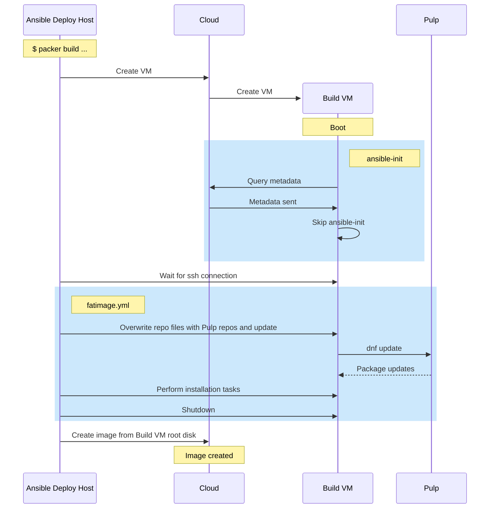
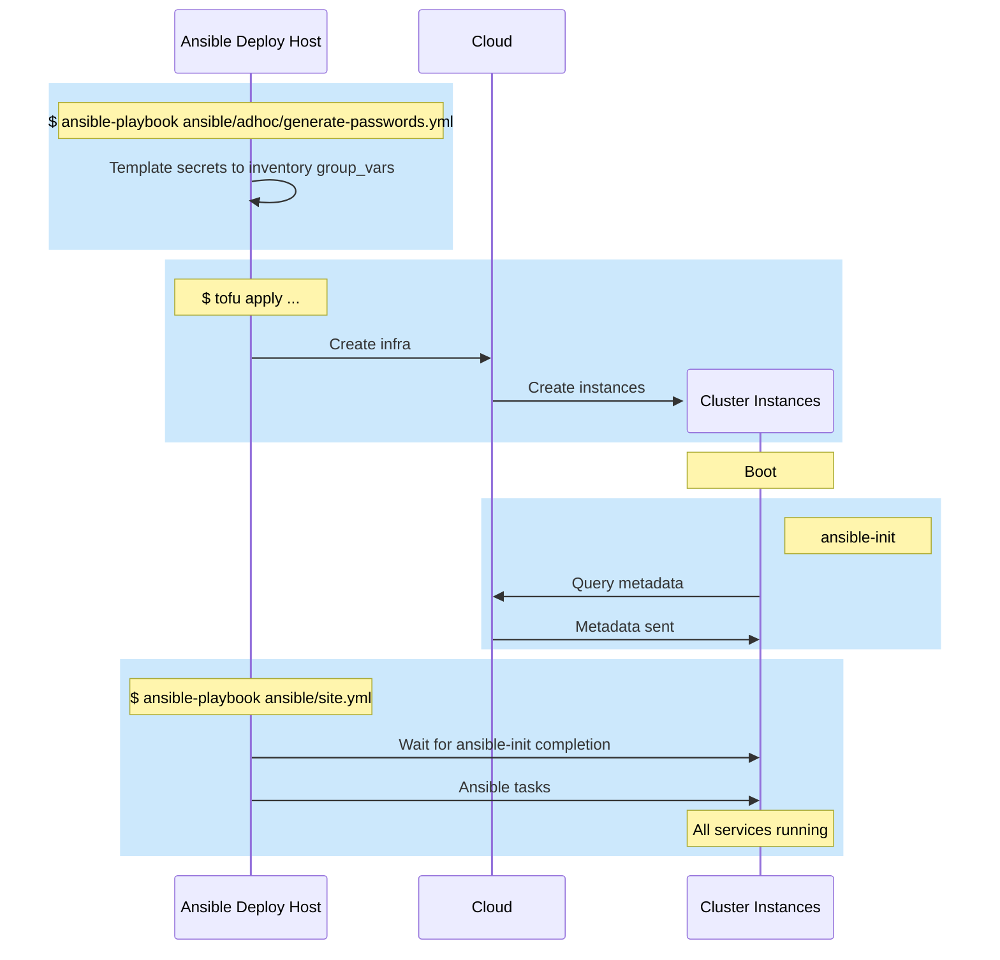
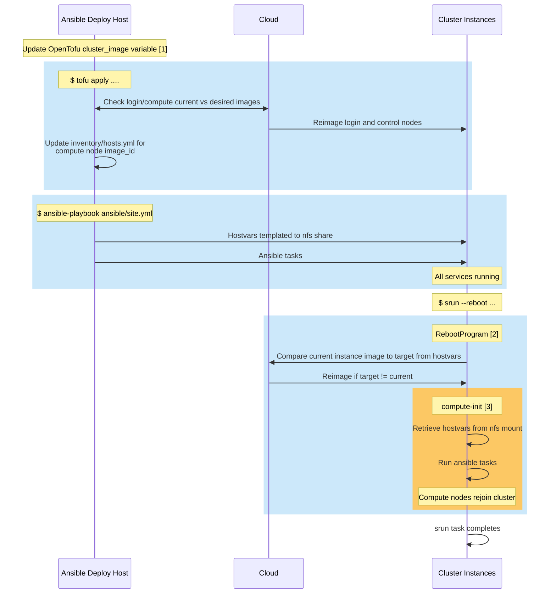

# Slurm Appliance Sequences

## Image build

This sequence applies to both:
- "fatimage" builds, starting from GenericCloud images and using
  control,login,compute inventory groups to install all packages, e.g. StackHPC
  CI builds
- "extra" builds, starting from StackHPC images and using selected inventory
  groups to add specfic features for a site-specific image.

Note that a generic Pulp server is shown in the below diagram. This may be
StackHPC's Ark server or a local Pulp mirroring Ark. It is assumed a local Pulp
has already had the relevant snapshots synced from Ark (although it is possible
to trigger this during an image build).

Note that ansible-init does not run during an image build. It is disabled via
a metadata flag.

## Cluster Creation

In the below it is assumed that no additional packages are installed beyond
what is present in the image, i.e. Ark/local Pulp access is not required.

## Slurm Controlled Rebuild

This sequence applies to active clusters, after running the `site.yml` playbook
for the first time. Slurm controlled rebuild requires that:
- Compute groups in the OpenTofu `compute` variable have:
    - `ignore_image_changes: true`
    - `compute_init_enable: ['compute', ... ]`
- The Ansible `rebuild` inventory group contains the `control` group.

TODO: should also document how compute-init does NOT run if the `site.yml`
playbook has not been run.

Notes:
1. And/or login/compute group overrides
2. Running on control node
3. On hosts targeted by job

