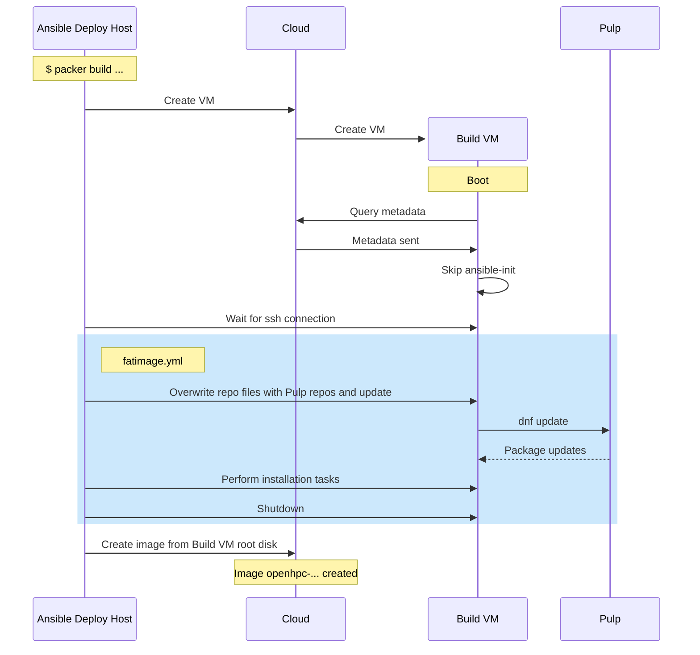
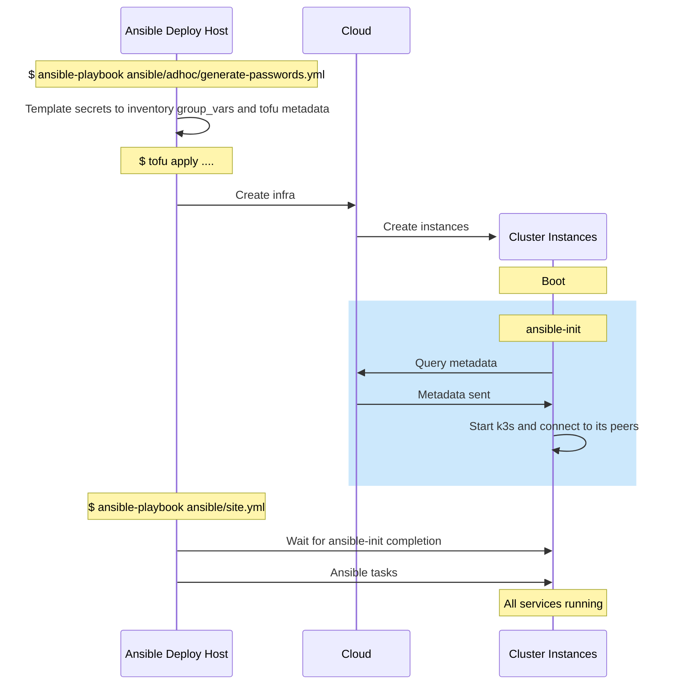

# Slurm Appliance Sequences


## Image build

This sequence applies to both:
- "fatimage" builds, starting from GenericCloud images and using
  control,login,compute inventory groups to install all packages, e.g. StackHPC
  CI builds
- "extra" builds, starting from StackHPC images and using selected inventory
  groups to add specfic features for a site-specific image.

Note that a generic Pulp server is shown in the below diagram. This may be
StackHPC's Ark server or a local Pulp mirroring Ark. It is assumed a local Pulp
has already had the relevant snapshots synced from Ark (although it is possible
to trigger this during an image build).

Note that ansible-init does not run during an image build. It is disabled via
a metadata flag.



## Cluster Creation



## Slurm Controlled Rebuild

This sequence applies to active clusters, after running ansible/site.yml for the first time. Slurm controlled rebuild requires:
- `ignore_image_changes: true` in `main.tf`
- `compute_init_enable: ['compute',..]` in `main.tf`
- `rebuild` group is populated with `control` in the inventory


```mermaid
sequenceDiagram
    participant ansible as Ansible Deploy Host
    participant cloud as Cloud
    participant nodes as Cluster Instances
    note over ansible: Update cluster_image.auto.tfvars.json
    note over ansible: $ tofu apply ....
    ansible->>ansible: target_image templated to hostvars
    ansible->>cloud: Update state.tf with new image
    cloud->>nodes: Reimage login and control nodes
    note over ansible: $ ansible-playbook ansible/site.yml
    ansible->>nodes: Hostvars templated to NFS exports directory
    ansible->>nodes: Ansible tasks
    note over nodes: $ srun --reboot ...
    rect rgb(204, 232, 252)
    note over nodes: RebootProgram
    nodes->>cloud: Query and compare instance image
    cloud->>nodes: Reimage if target =/= current
    rect rgb(252, 200, 100)
    note over nodes: compute-init
    nodes->>nodes: Retrieve hostvars from nfs mount
    note over nodes: Compute nodes rejoin cluster
    end
    nodes->>nodes: srun task completes
    end
